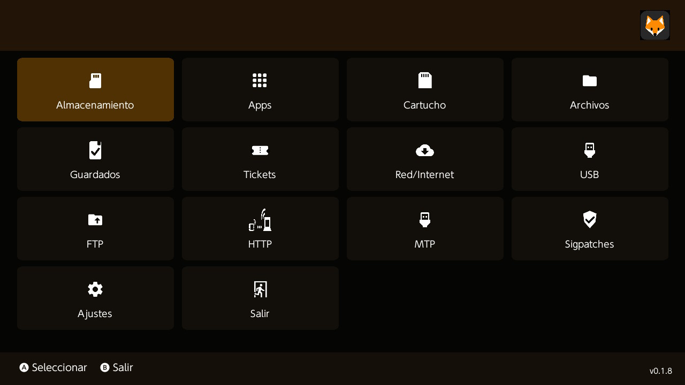

# FoxTools
Modern homebrew utility suite and file manager for Nintendo Switch

# FoxTools

<p align="center">
  
</p>

<p align="center">
  <b>Modern file manager for Nintendo Switch homebrew.</b>
</p>

<p align="center">
  Fast. Clean. Community-driven.
</p>

---

## Overview

FoxTools is a modern utility suite and advanced file manager for Nintendo Switch homebrew environments.

Built with a strong focus on:

* usability
* performance
* clean UI
* advanced filesystem operations
* modern UX design

FoxTools aims to provide a polished and reliable experience for power users while remaining intuitive for everyday usage.

---

## Features

### File Management

* Copy / Move / Rename / Delete
* Multi-selection support
* Recursive folder operations
* Fast directory navigation
* Storage information viewer

### Archive Support

* ZIP extraction
* Archive browsing
* Planned multi-format support

### USB Features

* USB file transfer
* PC connectivity tools
* Mass storage utilities

### Interface

* Modern UI inspired by native console aesthetics
* Smooth navigation
* Controller-friendly design
* Theme support (planned)

### Tools

* File search
* SD card utilities
* Metadata viewer
* Hex utilities (planned)
* Advanced system tools (planned)

---
## App Images

<p align="center">
  
</p>
<p align="center">
  
</p>
<p align="center">
  
</p>
<p align="center">
  
</p>


## Installation

Download the latest release from the Releases section.

Place:

```txt
FoxTools.nro
```

inside:

```txt
/switch/FoxTools/
```

Then launch FoxTools from the Homebrew Menu.

---

## Screenshots

> Work in progress

---

## Project Status

FoxTools is currently under active development.

Features, UI and internal systems may change between releases.

---

## Source Code

At this stage, FoxTools binaries are distributed publicly while source code is currently private.

The long-term goal is to build a stable, feature-complete platform before evaluating possible future openness for selected components.

---

## Philosophy

FoxTools was created with the idea that homebrew utilities should feel modern, fast and reliable.

The project focuses heavily on:

* user experience
* stability
* practical tooling
* clean design
* efficient workflows

---

## Roadmap

Planned features include:

* Theme engine
* Plugin system
* Network tools
* FTP support
* Integrated updater
* NSP content utilities
* Background tasks
* File previews
* Advanced archive management

---

## Disclaimer

FoxTools is intended for legal homebrew usage only.

The project does not support piracy, copyrighted content distribution or unauthorized use of Nintendo software.

---

## Credits

Developed by FoxTools Project.

Special thanks to the Nintendo Switch homebrew community.

---

## License

All rights reserved.

Unauthorized redistribution, modification or reverse engineering of FoxTools binaries may be restricted in future releases.

FoxTools and its assets may not be redistributed, modified or repackaged without permission.
